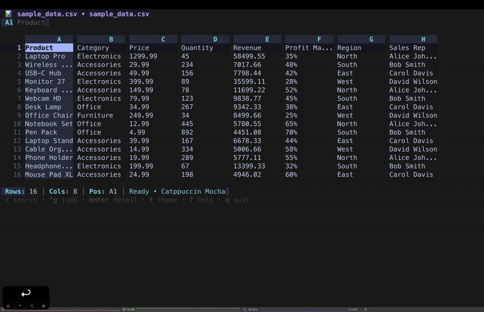

# 📊 Vex — Terminal Spreadsheet Editor

A beautiful, fast, and feature-rich terminal-based Excel and CSV editor with vim-style keybindings, live row filtering, instant data profiling, formula support, and chart export.

[](https://golang.org/)
[](LICENSE)
[](https://github.com/CodeOne45/vex-tui/releases)
[](https://github.com/CodeOne45/vex-tui/stargazers)

<a href="https://www.buymeacoffee.com/CodeOne45" target="_blank">
  
</a>



---

## ✨ Features

### 🔍 Live Row Filtering

Press `f` to filter any dataset without leaving the keyboard:

```
f  →  type expression  →  Enter to apply  •  Esc to clear
```

| Expression | Matches |
|---|---|
| `apple` | rows containing "apple" (case-insensitive) |
| `>1000` | rows where current column > 1000 |
| `<=50.5` | rows where current column ≤ 50.5 |
| `=Canada` | exact match (text or number) |

- **Tab** while typing toggles between current column and all columns
- Active filter shown in the title bar as `▾ >1000`
- **Esc** clears the filter instantly — original data is always preserved in memory
- Works on any column of any CSV or Excel file

### 📊 Data Profile

Press `W` to get a full column-by-column breakdown of any dataset — like `pandas.describe()` right in your terminal:

```
  Col   Type      Non-null  Nulls   Stats
  A     number    1,234     0       Σ 2.4M  avg 1.9K  [0 – 9,999]
  B     text      1,230     4       891 unique  Alice, Bob, Carol…
  C     mixed     800       200     200 nulls, some numbers
```

- Auto-detects column types: number, text, mixed
- Shows non-null count, null count, unique values for text columns
- Shows Σ / avg / min / max for numeric columns
- Highlights the column currently under your cursor

### ↕️ Sort Columns

- `s` — sort current column **ascending**
- `S` — sort current column **descending**
- `u` — **unsort** — restore original row order

Sort indicator shown in the column header (`A↑`) and in the title bar.
Numeric and text columns are sorted with the appropriate comparison.
When freeze header is enabled, the header row stays pinned during sort.

### ⌶ Freeze Header Row

Press `Ctrl+R` to pin the first row permanently at the top while scrolling through large files. The `⌶` indicator appears in the title bar when active. Sort is freeze-header aware — the header row is never moved.

### 📈 Live Column Statistics

When the cursor is on any numeric column the status bar automatically shows:

```
Σ 45,230  avg 1,004  min 2  max 9,999  n=45
```

No selection required — just move your cursor.

### 📁 CSV — Any Delimiter, Auto-Detected

Vex reads the first line of every CSV file and picks the most likely delimiter from `,` `;` `\t` `|` automatically. You can also specify it explicitly:

```bash
vex data.csv                   # auto-detect
vex data.csv -d ';'            # semicolon
vex data.tsv -d '\t'           # tab
vex data.csv --delimiter '|'   # pipe
```

### 📊 Data Visualization with Chart Export

Select a range with `V`, then press `v` to open the chart viewer:

- **Bar chart** — supports negative values, responsive width, unfilled track
- **Line chart** — Bresenham algorithm draws actual connecting lines between points
- **Sparkline** — compact inline overview + bar chart
- **Pie chart** — proportional breakdown with legend

Press `p` inside the chart to export a beautiful PNG image via [`freeze`](https://github.com/charmbracelet/freeze):

```
p  →  saves data-chart.png next to your file
```

If `freeze` is not installed, vex shows the install command. No other terminal spreadsheet lets you share charts as images.

### 🎨 Ten Beautiful Themes

Press `t` to switch theme live. All themes are 256-color and truecolor compatible.

**Dark Themes:**
- **Catppuccin Mocha** — Soft pastels, perfect for all-day use
- **Nord** — Cool Arctic blues, minimal and focused
- **Rosé Pine** — Elegant rose tones, sophisticated
- **Tokyo Night** — Vibrant cyberpunk aesthetic
- **Gruvbox** — Warm retro colors, comfortable
- **Dracula** — Classic high contrast theme

**Light Themes:**
- **Catppuccin Latte** — Gentle pastel light theme
- **Solarized Light** — Balanced contrast
- **GitHub Light** — Clean and minimal
- **One Light** — Soft Atom-inspired colors

### 🎨 Cell Type Coloring

Numbers, formulas, and text are visually distinct — no configuration needed:
- **Numbers** — accent color, easy to scan down columns
- **Formulas** — secondary color, instantly recognizable
- **Text** — default theme color

### ✏️ Full Editing Capabilities

- **Edit cells** with values or formulas (`i`)
- **Insert / delete** rows and columns
- **Copy / paste** single cells or multi-cell ranges (Tab-separated from any app)
- **Fill down / right** for quick data entry
- **Apply formulas** to entire ranges with automatic reference adjustment
- **Modification indicator** (`●`) in the title bar on first edit
- `Tab` / `Shift+Tab` in edit mode saves and jumps to the next/previous cell

### 📐 Powerful Formula Engine

**Arithmetic:** `=A1+B1`, `=C1*D1/E1`, `=B2-B1`

**15+ built-in functions:**

| Function | Description |
|---|---|
| `SUM(A1:A10)` | Sum a range |
| `AVERAGE(B1:B20)` / `AVG(...)` | Average values |
| `COUNT(C1:C50)` | Count numbers |
| `MAX(D1:D100)` / `MIN(...)` | Find extremes |
| `IF(A1>100,"High","Low")` | Conditional logic |
| `CONCAT(A1," ",B1)` / `CONCATENATE(...)` | Join text |
| `UPPER(A1)` / `LOWER(A1)` | Change case |
| `LEN(A1)` | Text length |
| `ROUND(A1,2)` | Round to decimals |
| `ABS(A1)` / `SQRT(A1)` / `POWER(2,8)` | Math functions |

Auto-recalculates on every edit. Formula references auto-adjust when applied to a range.

### 🔍 Powerful Navigation

- **Vim-style keybindings** (`hjkl`) and arrow keys
- **Jump to cell** (`Ctrl+G`) — supports `A100`, `500`, or `10,5`
- **Search** (`/`) across cell values and formulas with `n`/`N` navigation
- **Page Up/Down**, `Home`/`End`, `gg`/`G`
- **Multi-sheet** support with `Tab` / `Shift+Tab`

### 📋 Data Operations

- **Copy** cell (`c`) or entire row (`C`) to clipboard
- **Paste** (`p`) — multi-row/column paste from any app
- **Export** (`e`) to CSV or JSON
- **Save** (`Ctrl+S`) with format preservation (xlsx / csv)
- **Save As** (`Ctrl+Shift+S`) to a new file
- **Toggle formula display** (`Ctrl+F`)
- **View cell details** (`Enter`) — full value, formula, and type

### 📑 File Support

- **Excel** (.xlsx, .xlsm, .xls) — full formula and multi-sheet support
- **CSV** — auto-delimiter detection, any separator
- **Multiple sheets** with easy navigation
- **Safe saving** — file format preserved on save

---

## 🚀 Installation

### Homebrew (macOS / Linux) — recommended

```bash
brew install CodeOne45/tap/vex
```

### go install

```bash
go install github.com/CodeOne45/vex-tui@latest
```

### Download binary

Pre-built binaries on the [releases page](https://github.com/CodeOne45/vex-tui/releases):
- macOS (Intel & Apple Silicon)
- Linux (x64 & ARM64)
- Windows (x64)

### Build from source

```bash
git clone https://github.com/CodeOne45/vex-tui.git
cd vex-tui
make build
sudo mv vex /usr/local/bin/
```

---

## 📖 Usage

```bash
vex data.xlsx                    # open Excel file
vex report.csv                   # open CSV (delimiter auto-detected)
vex data.csv -d ';'              # explicit semicolon delimiter
vex data.tsv -d '\t'             # tab-separated
vex file.xlsx --theme nord       # start with a specific theme
vex --help                       # show all options
```

---

## ⌨️ Keyboard Shortcuts

### Navigation

| Key | Action |
|---|---|
| `↑↓←→` / `hjkl` | Move cursor |
| `PgUp` / `PgDn` or `Ctrl+U/D` | Scroll page |
| `Home` / `End` or `0` / `$` | First / last column |
| `gg` / `G` | Top / bottom of file |
| `Tab` / `Shift+Tab` | Next / previous sheet |
| `Ctrl+G` | Jump to cell (`A100`, `500`, `10,5`) |

### Data & Analysis

| Key | Action |
|---|---|
| `f` | Filter rows — `>100`, `<=50`, `=exact`, `text` |
| `W` | Data profile — types, nulls, unique counts, stats |
| `s` / `S` | Sort column ascending / descending |
| `u` | Unsort — restore original order |
| `Ctrl+R` | Toggle freeze header row |
| `/` | Search cells and formulas |
| `n` / `N` | Next / previous search result |
| `Esc` | Clear filter / search / selection |

### Editing

| Key | Action |
|---|---|
| `i` | Enter edit mode |
| `Tab` / `Shift+Tab` | Save and move right / left |
| `Ctrl+S` | Save file |
| `Esc` | Cancel edit |
| `x` | Delete cell content |
| `dd` / `dc` | Delete row / column |
| `o` / `O` | Insert row / column |
| `c` / `C` | Copy cell / row |
| `p` | Paste |
| `Ctrl+J` / `Ctrl+L` | Fill down / right (requires selection) |
| `Ctrl+A` | Apply formula to range (requires selection) |

### View

| Key | Action |
|---|---|
| `>` / `<` | Widen / narrow column |
| `Ctrl+F` | Toggle formula display |
| `t` | Change theme |
| `?` | Toggle help |

### Visualization

| Key | Action |
|---|---|
| `V` | Start / finish range selection |
| `v` | Open chart (requires selection) |
| `1` / `2` / `3` / `4` | Bar / Line / Sparkline / Pie |
| `p` | Export chart as PNG image (inside chart view) |

### File

| Key | Action |
|---|---|
| `Ctrl+S` | Save |
| `Ctrl+Shift+S` | Save as |
| `e` | Export to CSV or JSON |
| `q` | Quit (press twice if unsaved) |

---

## 💡 Quick Start

### Explore an unknown CSV

```bash
vex data.csv
# W  → see column types, nulls, unique counts instantly
# f  → type >1000 to show only matching rows
# s  → sort the column under cursor
# u  → restore original order
```

### Visualize and export a chart

```
1. Press V  — start range selection
2. Move to end of data, press V  — finish selection
3. Press v  — open chart
4. Press 1-4  — switch chart type
5. Press p  — save as PNG (requires freeze: brew install charmbracelet/tap/freeze)
```

### Bulk formula entry

```
i             Enter edit mode
=A1*B1        Type formula
Tab           Save and move right
...           Continue typing
Ctrl+S        Save file
```

Or: enter one formula → select range with `V` → press `Ctrl+A` to apply with auto-adjusted references.

---

## 🏗️ Project Structure

```
vex-tui/
├── main.go                     # Entry point + CLI flags
├── internal/
│   ├── app/
│   │   ├── model.go            # State + filter/sort/stats logic
│   │   ├── update.go           # Event handling
│   │   ├── view.go             # Rendering, charts, data profile
│   │   ├── keys.go             # Keybindings
│   │   ├── edit.go             # Edit / save operations
│   │   └── formulas.go         # Formula evaluation engine
│   ├── loader/
│   │   ├── loader.go           # File loading + CSV delimiter detection
│   │   └── save.go             # File saving
│   ├── theme/
│   │   └── theme.go            # Theme definitions
│   └── ui/
│       └── ui.go               # Styles + helpers
└── pkg/
    └── models/
        └── models.go           # Data models + mode constants
```

---

## 🤝 Contributing

Contributions are welcome! Please open an issue first for large changes.

```bash
git clone https://github.com/CodeOne45/vex-tui.git
cd vex-tui
make test            # run tests
make build           # build binary
make snapshot        # local multi-platform build via goreleaser
make tag VER=v2.1.0  # tag + push → triggers GitHub Actions release
```

Follow [Effective Go](https://golang.org/doc/effective_go.html) and run `make fmt` before opening a PR.

---

## ☕ Support

If Vex saves you time or you just enjoy using it:

<a href="https://www.buymeacoffee.com/CodeOne45" target="_blank">
  
</a>

Every coffee keeps the terminal dream alive. ☕

---

## 📄 License

MIT — see [LICENSE](LICENSE).

## 🙏 Acknowledgments

- [Bubble Tea](https://github.com/charmbracelet/bubbletea) — TUI framework
- [Lipgloss](https://github.com/charmbracelet/lipgloss) — terminal styling
- [Freeze](https://github.com/charmbracelet/freeze) — chart PNG export
- [Excelize](https://github.com/xuri/excelize) — Excel parsing
- [atotto/clipboard](https://github.com/atotto/clipboard) — clipboard support
- Themes inspired by [Catppuccin](https://github.com/catppuccin/catppuccin), [Nord](https://www.nordtheme.com/), [Rosé Pine](https://rosepinetheme.com/), and others

## 📮 Contact

- **GitHub**: [@CodeOne45](https://github.com/CodeOne45)
- **Issues**: [GitHub Issues](https://github.com/CodeOne45/vex-tui/issues)
- **Discussions**: [GitHub Discussions](https://github.com/CodeOne45/vex-tui/discussions)

---

⭐ If Vex is useful to you, a star goes a long way — thank you!

*Made with ❤️ for terminal enthusiasts and spreadsheet power users.*
